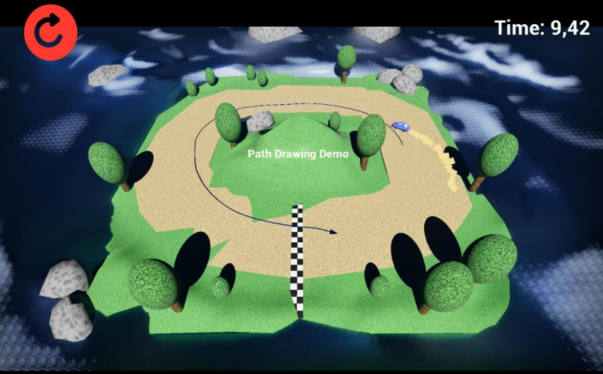

## Touch-Based Path Drawing System (Unreal Engine 5)

This repository documents my bachelor’s thesis project, where I designed and
implemented a touch-based path drawing system for a mobile game using Unreal Engine 5.

The project focuses on system design, performance considerations, and mobile
optimization rather than traditional source code. The core logic was implemented
using Unreal Engine’s Blueprint visual scripting.

  

Short gameplay demo (YouTube):  
https://youtu.be/3kGAtbvXWKQ

Full bachelor’s thesis (Theseus):  
https://urn.fi/URN:NBN:fi:amk-2025053018695

---

## Project Overview
The goal of the project was to create a touch-based movement control system where
the player draws a path directly on the screen and the character follows it in-game.

Unlike traditional joystick or tap-to-move controls, this approach required careful
handling of:
- touch input accuracy
- path validation
- real-time visualization
- performance limitations on mobile devices

The result is a fully playable mobile game prototype demonstrating the system in use.

---

## What I Implemented
- A complete touch-based path drawing system for mobile devices
- Conversion of touch input into world-space paths
- Real-time visualization of the drawn path
- Character movement along the validated path
- Adjustable path accuracy based on performance constraints
- A playable top-down mobile game prototype to showcase the system

All gameplay logic and systems were implemented using **Blueprint visual scripting**.

---

## Path Visualization Approaches
Three different visualization methods were implemented and evaluated:

### Spline Mesh
- Visually clear and easy to implement
- Scales poorly with longer paths
- High draw call count on mobile devices

### Procedural Mesh
- Single mesh with constant draw call count
- Best overall performance
- Required more careful handling of geometry and updates

### Niagara Particle System
- Most visually appealing solution
- Low draw calls
- High CPU load when path length increased

---

## Performance Considerations
Mobile performance was a central focus of the thesis.

Key findings:
- Draw calls were the main performance bottleneck
- Spline Mesh solutions exceeded recommended mobile limits
- Procedural Mesh scaled best across different path lengths
- Niagara required strict limits to remain performant

To address this, the system dynamically adjusts path accuracy based on current
performance, allowing it to scale between low-end and high-end devices.

---

## What I Learned
- Designing non-standard control systems for mobile games
- Unreal Engine 5 Blueprint architecture and system-level thinking
- Performance profiling and optimization on mobile platforms
- Making informed trade-offs between visual quality and performance
- Translating an abstract idea into a playable, testable system

---
This repository is documentation-focused. The project logic was implemented using
Blueprint visual scripting, so there is no traditional source code included here.
